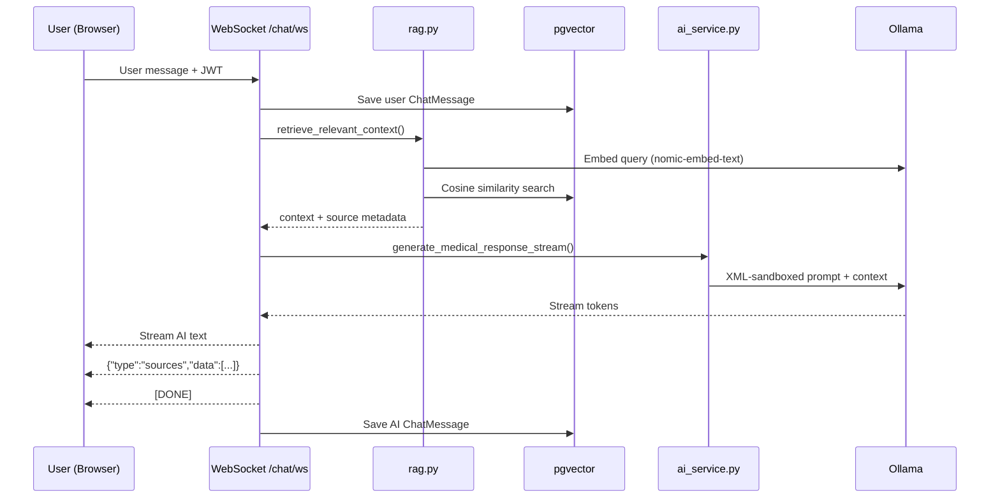

# Medipal — AI-Powered Healthcare Assistant

**Medipal** is a privacy-first, fully local healthcare intelligence platform. A React single-page app talks to a FastAPI backend, PostgreSQL with **pgvector**, and on-device inference via **Ollama**. Clinical reference data, embeddings, and generative responses stay under your control—no third-party cloud AI APIs required.

---

## Core Features

| Capability | Description |
|------------|-------------|
| **JWT authentication** | Register, login, and protected routes with role-based access (`user` / `admin`). |
| **Real-time symptom chat** | Streaming WebSocket chat (`/chat/ws`) with persistent message history. |
| **Local RAG pipeline** | pgvector cosine search over ingested medical documents, grounded by Ollama `llama3.2`. |
| **Clinical citations** | Retrieved source chunks surfaced as citation badges beneath each AI reply. |
| **Specialist recommendation** | Provider matching from PostgreSQL, filterable by specialty. |
| **Admin document ingestion** | Drag-and-drop upload for **PDF**, **CSV**, **TXT**, and **Markdown** with background chunking and embedding. |

---

## Technology Stack

| Layer | Technologies |
|-------|--------------|
| **Frontend** | React 18, Vite 8, TypeScript, Tailwind CSS, shadcn/ui, TanStack Query, React Router, Axios |
| **Backend** | FastAPI, Uvicorn, Pydantic v2, SQLAlchemy 2.0 (async), Alembic, bcrypt, python-jose |
| **Database** | PostgreSQL 15 + **pgvector** (`pgvector/pgvector:pg15`) |
| **AI / ML** | Ollama (`llama3.2`, `nomic-embed-text`), LangChain |
| **Infrastructure** | Docker Compose, asyncpg |

---

## System Architecture

```mermaid
graph TD
    subgraph Client["Frontend (React + Vite :8080)"]
        UI[Chat / Admin / Specialists]
        Proxy[Vite Proxy /api → :8000]
    end

    subgraph API["FastAPI Backend (:8000)"]
        AUTH[/auth — JWT]
        CHAT[/chat — REST + WebSocket]
        ADMIN[/admin — Upload]
        RAG[rag.py — Vector Retrieval]
        AI[ai_service.py — XML RAG Prompt]
        ING[ingestion_service.py]
    end

    subgraph Data["PostgreSQL (:5432)"]
        PG[(medipal_db)]
        VEC[medical_documents + pgvector]
        MSG[chat_messages]
        USR[users]
        SPEC[specialists]
    end

    subgraph LocalAI["Ollama (:11434)"]
        LLM[llama3.2]
        EMB[nomic-embed-text]
    end

    UI --> Proxy
    UI -.->|ws://localhost:8000/chat/ws| CHAT
    Proxy --> AUTH
    Proxy --> CHAT
    Proxy --> ADMIN
    CHAT --> RAG
    CHAT --> AI
    RAG --> EMB
    RAG --> VEC
    AI --> LLM
    ING --> EMB
    ING --> VEC
    AUTH --> USR
    CHAT --> MSG
```

### RAG + Citation Flow



---

## Project Structure

```
medipal/
├── alembic/                    # Database migrations
├── docker-compose.yml          # PostgreSQL + pgvector
├── .env.example                # Docker DB credentials template
├── LICENSE
├── package.json
├── vite.config.ts              # Dev server + /api proxy
│
├── src/                        # React frontend
│   ├── components/
│   │   ├── ChatInterface.tsx   # WebSocket chat + citations
│   │   ├── DataIngestion.tsx   # Admin upload UI
│   │   ├── ProtectedRoute.tsx
│   │   └── AppNavbar.tsx
│   ├── context/AuthContext.tsx
│   ├── pages/                  # Index, Chat, Login, Register, Admin
│   └── lib/auth.ts
│
└── backend/
    ├── .env.example            # API secrets template
    ├── requirements.txt
    └── app/
        ├── main.py
        ├── routers/            # auth, chat, admin, specialists
        ├── services/
        │   ├── rag.py          # Vector retrieval + citations
        │   ├── ai_service.py   # XML prompt + response sanitization
        │   └── ingestion_service.py
        ├── models/             # User, MedicalDocument, ChatMessage, Specialist
        ├── scripts/            # ingest_data, seed_specialists
        └── data/
            ├── sample_guidelines.txt
            └── uploads/        # Runtime uploads (gitignored)
```

---

## Quick Start

### Prerequisites

1. [Docker Desktop](https://www.docker.com/products/docker-desktop/)
2. [Ollama](https://ollama.com/)
3. **Node.js 18+** and **npm**
4. **Python 3.11+** (3.13 supported; uses native `bcrypt`, not passlib)

Pull Ollama models:

```bash
ollama pull llama3.2
ollama pull nomic-embed-text
ollama serve
```

---

### 1. Clone & configure environment

```bash
git clone https://github.com/vishal-ch336/medipal.git
cd medipal

# Docker database credentials
cp .env.example .env

# FastAPI runtime secrets
cp backend/.env.example backend/.env
```

Edit both files and set a strong `POSTGRES_PASSWORD` / matching `DATABASE_URL` password and a random `SECRET_KEY`.

> **Never commit `.env` files.** They are listed in `.gitignore`.

---

### 2. Start the database

```bash
docker compose up -d
```

---

### 3. Backend

```bash
cd backend
python -m venv .venv

# Windows (PowerShell)
.venv\Scripts\Activate.ps1

# macOS / Linux
source .venv/bin/activate

pip install -r requirements.txt
alembic upgrade head
python -m app.scripts.seed_specialists
python -m app.scripts.ingest_data --dir app/data/

uvicorn app.main:app --reload --host 127.0.0.1 --port 8000
```

API docs: [http://127.0.0.1:8000/docs](http://127.0.0.1:8000/docs)

---

### 4. Frontend

From the project root:

```bash
npm install
npm run dev
```

App: [http://localhost:8080](http://localhost:8080)

| Route | Access | Purpose |
|-------|--------|---------|
| `/` | Public | Landing page |
| `/register` | Public | Create account |
| `/login` | Public | Sign in |
| `/chat` | Authenticated | Symptom chat with citations |
| `/admin` | Admin only | Document ingestion |

**Local dev networking:** REST calls use the Vite proxy (`/api/*` → `:8000`). The chat WebSocket connects directly to `ws://localhost:8000/chat/ws?token=...`.

---

## API Reference

| Method | Endpoint | Auth | Description |
|--------|----------|------|-------------|
| `POST` | `/auth/register` | — | Create user |
| `POST` | `/auth/token` | — | Obtain JWT |
| `GET` | `/auth/me` | Bearer | Current user profile |
| `POST` | `/chat/` | — | Synchronous RAG reply |
| `WS` | `/chat/ws?token=` | JWT query param | Streaming chat + citations |
| `GET` | `/chat/history` | Bearer | User chat history |
| `POST` | `/admin/upload` | Admin Bearer | Upload document for ingestion |
| `GET` | `/specialists/` | — | List specialists (`?specialty=`) |

### WebSocket message protocol

1. Client sends plain-text user message.
2. Server streams AI response tokens.
3. Server sends `{"type":"sources","data":[{"id":"...","title":"..."}]}`.
4. Server sends `[DONE]`.

---

## Operational Scripts

```bash
# Bulk-ingest supported files from a directory
python -m app.scripts.ingest_data --dir app/data/

# Seed mock specialist data (idempotent)
python -m app.scripts.seed_specialists
```

Supported formats: `.txt`, `.md`, `.pdf`, `.csv`.

---

## Development Commands

```bash
# Frontend
npm run dev
npm run build
npm run lint

# Backend
uvicorn app.main:app --reload
alembic revision --autogenerate -m "description"
alembic upgrade head
```

---

## Pushing to GitHub

1. Ensure secrets are not tracked:

   ```bash
   git status
   ```

   Confirm `.env`, `backend/.env`, `node_modules/`, `dist/`, and `backend/app/data/uploads/*` are ignored.

2. Stage and commit:

   ```bash
   git add .
   git commit -m "Prepare repository for public release"
   ```

3. Push (requires write access to the remote):

   ```bash
   git push origin main
   ```

If push is rejected due to permissions, fork the repository or update the remote:

```bash
git remote set-url origin https://github.com/YOUR_USERNAME/medipal.git
git push -u origin main
```

---

## Security Notes

- Default Docker password in `.env.example` is a placeholder—change it before deploying.
- CORS is set to `allow_origins=["*"]` for local development only.
- This project is **not** HIPAA-compliant or clinically validated.

---

## Medical Disclaimer

> **IMPORTANT — NOT FOR CLINICAL USE**
>
> Medipal is provided for **educational and demonstration purposes** only. AI-generated information **does not constitute professional medical advice, diagnosis, or treatment**. Always consult a licensed healthcare provider. In an emergency, contact local emergency services immediately.

---

## License

[MIT License](LICENSE)
